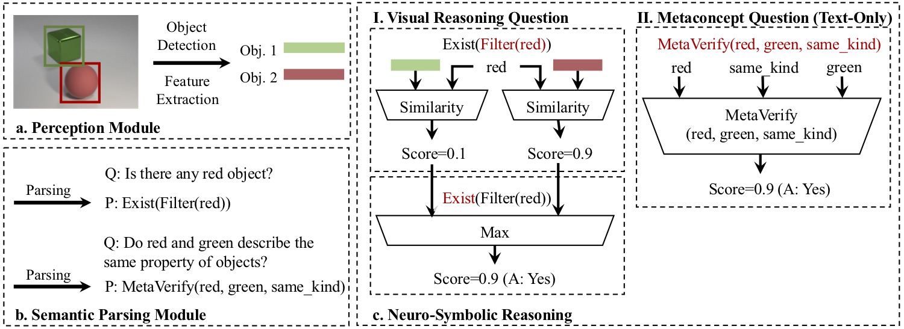
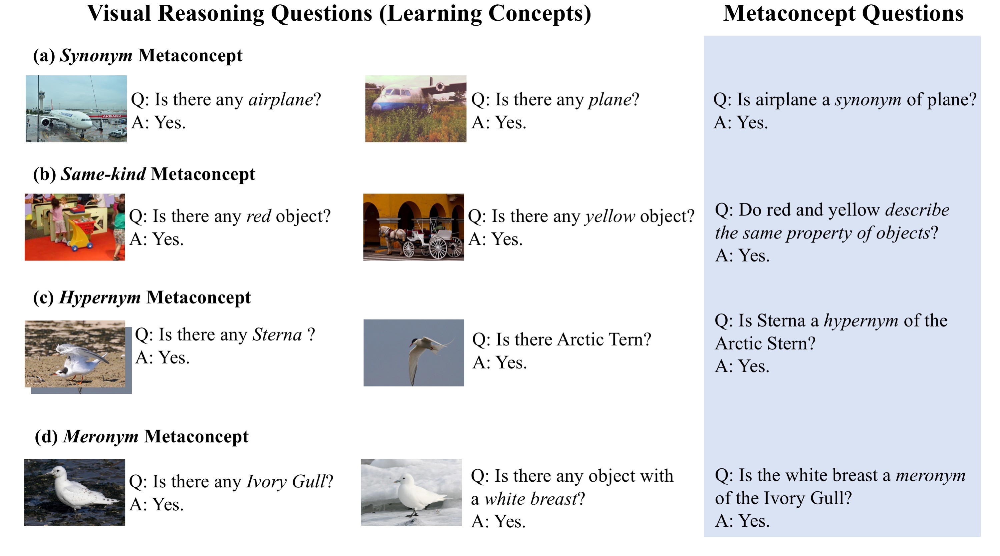

# Visual Concept-Metaconcept Learning (VCML)
This is a Pytorch implementation for the [VCML paper][VCML].

<div align="center">
  
</div>

### Publication
**[Visual Concept-Metaconcept Learning][VCML]**
<br />
[Chi Han*][mine]
[Jiayuan Mao*](http://jiayuanm.com), 
[Chuang Gan](http://people.csail.mit.edu/ganchuang/), 
[Joshua B. Tenenbaum](https://web.mit.edu/cocosci/josh.html), and
[Jiajun Wu](https://jiajunwu.com/)
<br />
In [Neural Information Processing Systems (NeurIPS) 2019][NeurIPS2019]
<br />
[[Paper]][paper_page]
[[Project Page]][VCML]
[[BibTex]](http://vcml.csail.mit.edu/data/bibtex/2019NeurIPS-VCML.bib)

```
@inproceedings{Han2019Visual,
	title={{Visual Concept Metaconcept Learning}},
	author={Han, Chi and Mao, Jiayuan and Gan, Chuang and Tenenbaum, Joshua B. and Wu, Jiajun},
	booktitle={Advances in Neural Information Processing Systems (NIPS)},
	year={2019},
}
```

## Prerequisites

- Python 3.6
- PyTorch 1.2, with NVIDIA CUDA Support
- [Jacinle][Jacinle] and other required python packages specified by `requirements.txt`. See **Getting started**.

## Getting started

### Install [Jacinle][Jacinle]

To install, you should first clone the package, and add the bin path to your global `PATH` environment variable:
```
git clone https://github.com/vacancy/Jacinle --recursive
export PATH=<path_to_jacinle>/bin:$PATH
```

### Clone repository and install other packages

Clone this repository:

```
git clone https://github.com/Glaciohound/VCML.git
```

Create a conda environment for VCML, and install the requirements:

```
conda create -n VCML python=3.6
conda activate VCML
conda install --file requirements.txt
pip install pytorch-transformers
```

## The Dataset

### Prepare the dataset.

We augmented both synthetic ([CLEVR][CLEVR]) and natural image ([GQA][GQA], [CUB-200][CUB]) datasets with text-only metaconcept questions, and evaluated the performance of different models. We use programs to generate synthetic questions and answers, based on the ground-truth annotations of visual concepts.

To replicate the experiments, you will need to follow the instructions below:

First, prepare a directory `{data_dir}` for the dataset.

Second, download the [CLEVR dataset][CLEVR_download], [GQA dataset][GQA_download] and [CUB dataset][CUB_download], and move the image folders to path `{data_dir}/CLEVR/raw/images`, `{data_dir}/GQA/raw/images`, `{data_dir}/CUB/raw/images`, respectively.
Alternatively, you may run command 
```
sh ./scripts/dataset/download.sh {data_dir}
```
to automatically do this.

Fianlly run the command: 
```
sh ./scripts/dataset/prepare.sh {data_dir}
```
this script will download our [dataset-augmentation][Augmentation_download], and organize all the data into the following structure:

```
{data_dir}
├── CLEVR
│   ├── raw
│   │   ├── images
│   │   │   └── ...
│   │   ├── COPYRIGHT.txt
│   │   └── LICENSE.txt
│   └── augmentation
│       ├── questions
│       │   └── synonym_generalization
│       │   │   └── ...
│       │   └── samekind_generalization 
│       │   │   └── ...
│       │   └── ...
│       └── sceneGraphs.pkl
├── CUB
│   ├── raw
│   │   └── ...
│   └── augmentation
│       └── ...
└── GQA
    └── ...
```

The dataset directory is now all set. The `{data_dir}/cub` and `{data_dir}/gqa` is organized in a way similar to `dataset/clevr`, so some parts of the directory tree are omitted.

The `{data_dir}/{name}/original` generally contains the original data from the [CLRVR][CLEVR], [GQA][GQA] or [CUB][CUB] sub-dataset, though slightly re-organized and tailored.
The `{data_dir}/{name}/augmentation/questions/metaconcept_questions` directory contains the augmented metaconcept questions. These questions are generated according to the groundtruth metaconcept knowledge we extracted on the ontology of each dataset.
To know more about the groudtruch knowledge we used, you may find it helpful to explore our `{VCML}/knowledge` directory.

(If you would like to run the [MAC][MAC_paper] baseline, you can download the [feature files from here][MAC_needed].
Note that in order to fine-tune the ResNet, the file contains only raw image, and you will need to modify the [MAC code][MAC_code] to contain a trainable ResNet module.)

### About the augmented questions

As explained above, we augmented existing datasets with metaconcept reasoning questions, based on the ontology knowledge of th datasets.
The follow image serves as an overview of the final dataset, combining visual reasoning questions (for visually-grounding **Concepts**) and text-only metaconcept questions (for learning **Metaconcepts** based on learned concepts).

On th one hand, visual quesitions provides visual cues for the concepts, which help the learning of Metaconcepts.
On the other hand, Metaconcepts serves as abtract-level supervision, which may help the learning of visual concepts.

<div align="center">
  
</div>

For further details, you are encouraged to check out the explanation in [`{VCML}/knowledge/`](knowledge/).

## Training and evaluation.

Before running, you will need to prepare a directory `{log_dir}` to store the results, (which should contain sufficient space if you wish to keep the checkpoints and debugging information). The path to this directory will be passed to `--log_dir` option when running.

All commands for reproducing the results in the paper are explained in [`{VCML}/scripts/commands.md`][commands]. Here we show with examples of how to use them.

*Note: Make sure you are connected to the Internet before training, as the code might download pretrained weights for some components at the beginning.*

### to run one single experiment

You may run the following command to run a "Concepts help _synonym_ metaconcept generalization" on CLEVR dataset.
```
jac-crun <GPU-id> scripts/main.py --mode run-experiment --task CLEVR --model VCML --experiment synonym_generalization --num_parallel 1 --log_dir {log_dir} --data_dir {data_dir}
```
You may replace `--log_dir {log_dir}` with `--silent` if you do not want to save logging files or checkpoints.

You will see a detailed logging on console:
```
0:00:00.00 | => scripts/main.py --mode run-experiment --task clevr --model vcml --experiment
           |    synonym_generalization --name clevr_SynGen --num_parallel 1
0:00:00.01 | => Current Time is: xxxx-xx-xx xx:xx:xx
0:00:00.03 | => Printing Arguments
0:00:00.77 | => balance_classification    : False
           |    batch_size                : 10
           |    box_scale                 : 1024
           ...
           |    
0:00:00.79 | => Loading sceneGraphs
0:00:11.75 | -----> Loaded sceneGraphs from: ...
           |        SceneGraphs size: ...
0:00:11.92 | -----> Loading referential-expression dataset from ...
           |        SceneGraphs size: ...
0:00:12.59 | => Loading Word_Index instances
0:00:12.72 | -----> loading Word_Index: words
           |        from file ..., length=xx
0:00:13.31 | -----> loading Word_Index: concepts
           |        from file ..., length=xx
0:00:13.62 | -----> loading Word_Index: metaconcepts
           |        from file ..., length=xx
	   ...
0:00:14.44 | => Loading question dataset
0:00:14.73 | -----> Selecting test concepts: 
	   ...
0:00:14.44 | => Loading question dataset
0:00:14.73 | -----> Selecting test concepts: 
           ...
```

### to run multiple parallel experiments

If you have multiple GPUs available on one machine, you may choose to run several experiments with different random-seeds with one command. This would be helpful if you wish to reduce and measure the varaince of results. You should specify the GPUs you are using on the machine after `jac-crun`, and specify the number of paralle experiments in the `--num_parallel` option. For example:
```
jac-crun 0,1,2,3 scripts/main.py --mode run-experiment --task CLEVR --model VCML --experiment synonym_generalization --num_parallel 4 --log_dir {log_dir} --data_dir {data_dir}
```

### to use pre-trained checkpoints

You can add `--pretrained` argument to use our pretrained checkpoints. The checkpoints will be automatically downloaded and loaded.

For more details, you are encouraged to refer to [`{VCML}/scripts/commands.md`][commands] for more comands and a better explanation of option usage.
This file contains all the commands needed to run experiments.


## Model Implementation

For details about how the VCML framework is implemented, you may be interested in codes in [`models/model/vcml_model.py`](models/model/vcml_model.py) and [`models/nn/framework`](models/nn/framework).
The implementation of denotational probabilities is in [`models/nn/framework/functional.py`](models/nn/framework/functional.py) [`models/nn/framework/sub_functional.py`](models/nn/framework/sub_functional.py).

The semantic parser for questions is adopted from [Kexin Yi's implementation of NS-VQA][NS-VQA]. Codes for the semantic parser are in directory [`reason/`](reason)


[mine]: http://hanchi.me
[VCML]: http://vcml.csail.mit.edu
[NeurIPS2019]: https://neurips.cc/Conferences/2019
[paper_page]: http://vcml.csail.mit.edu/data/papers/2019NeurIPS-VCML.pdf
[Jacinle]: https://github.com/vacancy/Jacinle
[MAC_code]: https://github.com/stanfordnlp/mac-network
[MAC_paper]: https://arxiv.org/pdf/1803.03067.pdf

[CLEVR]: https://cs.stanford.edu/people/jcjohns/clevr/
[GQA]: https://cs.stanford.edu/people/dorarad/gqa/index.html
[CUB]: http://www.vision.caltech.edu/visipedia/CUB-200-2011.html
[CLEVR_download]: https://dl.fbaipublicfiles.com/clevr/CLEVR_v1.0.zip
[GQA_download]: https://nlp.stanford.edu/data/gqa/images.zip
[CUB_download]: http://www.vision.caltech.edu/visipedia-data/CUB-200-2011/CUB_200_2011.tgz
[Augmentation_download]: http://vcml.csail.mit.edu/data/dataset_augmentation.tgz
[MAC_needed]: http://vcml.csail.mit.edu/data/MAC_needed.tgz
[commands]: scripts/commands.md
[NS-VQA]: https://github.com/kexinyi/ns-vqa
